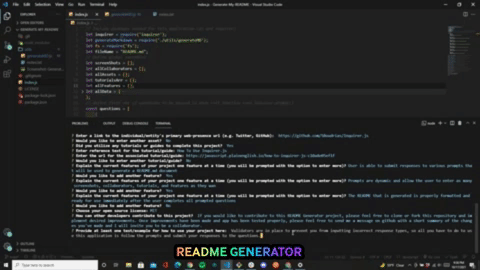

# Generate My README

## Description

Every single coding project and assignment needs a README page. This README Generator was created to make the process of creating a professional README smooth and simple for anyone regardless of your coding skills.

Markdown skills are not required to use this app... all you have to do is launch the app in your console, answer some questions, and let the magic happen. Sick of the endless repetition and the constant need to reference the markdown documentation? Then this is the app for you.

Creating a README Generator was extremely fun and rewarding, so if you have any further suggestions of improvement to the application, please feel free to clone it down and transform it into YOUR go-to README generator.

[Watch This Video To See The App In Action](https://drive.google.com/file/d/1U-lVZOuBPv9pasmeFspoqal7oS4Llxk5/view?usp=sharing)

## Table of Contents

- [Installation](#installation)
- [Usage](#usage)
- [Credits](#credits)
- [License](#license)
- [Features](#features)
- [Examples/Tests](#examples)

## Installation

- To install the app, simply clone this repository down to your local machine.

## Usage

- To use the application, all you have to do is navigate to the cloned down repository, run "npm i" to get the necessary node modules

- Then initiate the application by running "node index.js"

Screenshot:

## Credits

Assets:

+ [inquirer by Simon Boudrias](https://github.com/SBoudrias/Inquirer.js)

Tutorials:

+ [How To Use Inquirer.js](https://javascript.plainenglish.io/how-to-inquirer-js-c10a4e05ef1f)

## License

+ MIT

## Features

+ User is able to submit responses to various prompts that will be used to generate a README.md document

+ Prompts are dynamic and allow the user to enter as many screenshots, collaborators, tutorials, and features as they wan

+ The README that is generated is properly formatted and ready for use immediately after the user completes all prompted questions

## How to Contribute

If you would like to contribute to this README Generator project, please feel free to clone or fork this repository and implement desired improvements. Once improvements have been made and app has been tested properly, please feel free to send me a message on github with a short summary of the changes you've made and I will invite you to be a collaborator.

## Examples

Validators are in place to prevent you from inputting incorrect response types, so all you have to do to use this application is follow the prompts and submit your responses to the questions.

## Questions

Connect with me on GitHub: [damienluzzo33](https://www.github.com/damienluzzo33)

Shoot me an email: [damienluzzo33@gmail.com](mailto:damienluzzo33@gmail.com)